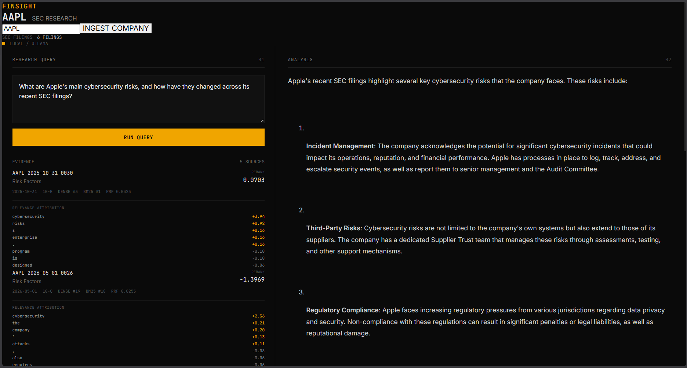

# FinSight

FinSight is a financial research system for SEC EDGAR filings. Enter any public company ticker, ingest its filings, and ask natural language questions grounded in retrieved filing evidence.

Built to understand what happens underneath RAG systems, retrieval, reranking, attribution, and grounded generation rather than wrapping an existing framework.

---


## Architecture

```
Ticker → SEC EDGAR → Ingestion → Chunking → Embeddings
                                                  |
                                    +-------------+-------------+
                                    |                           |
                                  FAISS                     ChromaDB
                                    |                           |
                                    +----------+----------------+
                                               |
                                        Dense Retrieval
                                               |
                                        BM25 Retrieval
                                               |
                                    Reciprocal Rank Fusion
                                               |
                                      Cross-Encoder Reranker
                                               |
                                       SHAP Attribution
                                               |
                                        Qwen via Ollama
                                               |
                                        Grounded Answer
```

---

## Retrieval Pipeline

FinSight combines semantic and lexical retrieval with reranking.

| Method            | Recall@5 | Precision@5 | MRR   |
|-------------------|----------|-------------|-------|
| Dense             | 30.6%    | 10.0%       | 0.333 |
| BM25              | 5.6%     | 3.3%        | 0.056 |
| Hybrid (RRF)      | 38.9%    | 16.7%       | 0.514 |
| Hybrid + Reranker | **55.6%**| **23.3%**   | 0.375 |

Hybrid retrieval with CrossEncoder reranking improves Recall@5 by **81% over dense-only retrieval** on a financial QA benchmark derived from Apple SEC filings.

**Why this matters:** Dense retrieval misses exact financial terms like ticker symbols, section headers, and specific figures. BM25 catches these but lacks semantic understanding. RRF fusion captures both. The CrossEncoder reranker then scores query-chunk pairs jointly rather than independently, catching relevance that bi-encoders miss.

---

## Explainability

SHAP attribution runs on reranker scores, identifying which tokens in a query drove chunk relevance up or down. This makes retrieval decisions auditable — critical for financial applications where answer provenance matters.

---

## Tech Stack

**Backend:** Python, FastAPI, SentenceTransformers, FAISS, ChromaDB, BM25, CrossEncoder, SHAP, Ollama (Qwen 2.5 7B)

**Frontend:** React, Vite

**Data:** SEC EDGAR API

---

## Setup

```bash
python -m venv .venv
.venv\Scripts\activate
pip install -r requirements.txt
cd frontend && npm install && cd ..
ollama pull qwen2.5:7b-instruct
```

---

## Running

```bash
# Backend
uvicorn api:app --reload

# Frontend (separate terminal)
cd frontend && npm run dev
```

---

## API

| Method | Endpoint | Description |
|--------|----------|-------------|
| GET | `/api/health` | Health check |
| GET | `/api/companies` | List ingested companies |
| POST | `/api/ingest` | Ingest a company's filings |
| POST | `/api/query` | Query filings |
| POST | `/api/temporal` | Temporal analysis across filings |

**Ingest:**
```json
{ "ticker": "MSFT" }
```

**Query:**
```json
{ "ticker": "MSFT", "query": "What are Microsoft's main cybersecurity risks?" }
```

Query responses include the generated answer, retrieved chunks with filing metadata, dense/BM25/RRF/reranker scores per chunk, and SHAP relevance attribution.

---

## Example

```
Ticker: AAPL
Query:  What are Apple's main revenue risks?
```

FinSight retrieves relevant sections from Apple's SEC filings, reranks the evidence, generates a grounded answer using the local LLM, and surfaces chunk-level relevance attribution in the interface.

---

## Project Structure

```
Finsight/
├── api.py
├── src/
│   ├── ingestion/
│   ├── preprocessing/
│   ├── retrieval/
│   ├── generation/
│   ├── explainability/
│   ├── evaluation/
│   └── agents/
├── frontend/
├── tests/
├── results/
└── requirements.txt
```
